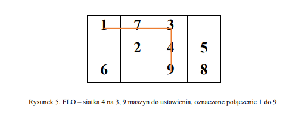
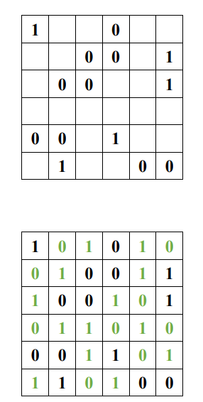
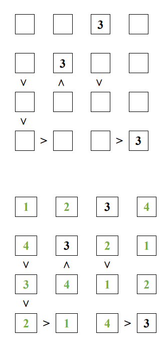
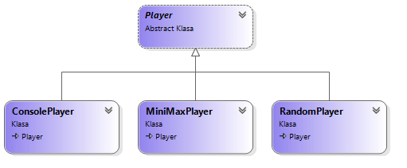
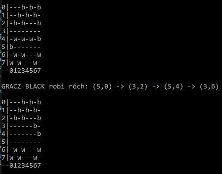
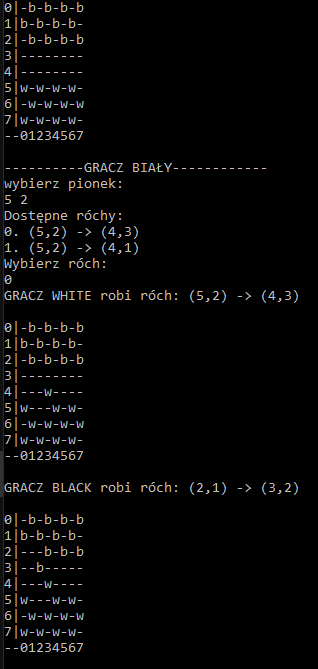

# AI - Labolatories
This repo contains 4 projects implemented during my classes.

# Genethic alghoritm (Algorytm generyczny - AG)

Genetic alghoritm imlementation in code used to solve problem of Facility Layout Optimization(see example).

9 "machines" placed in 3x4 grid need to be set up in such way, that cost (dependent on machine placement) is lowest or very close to lowest possible. Data samples [here](./Temat1_AG/dane/). Data doc [here](./Temat1_AG/dane/README.pdf)

# CSP (Constraint Satisfaction Problem)

CSP solver implemented along with two examples:

## Binary problem

* 0 or 1 for each cell
* max sequence of same numbers in row and cols is less than 3
* each row and collumn is unique
* each row and collumn has same number of 0 and 1

## Futoshiki problem

Rules explained [here](https://en.wikipedia.org/wiki/Futoshiki)

## Implementation

* [CSP](./Temat2_CSP/CSP/CSPBase/CSP.cs) - the definiton of CSP problem. Consists of constraints and current state
  * ForwardChecking - after setting variable value updates remaining variables domains. If some is empty we need to go back. 
  * BackTracking - sets next variable value until constraint is broken. If so then it's going back.
* [Constraint](./Temat2_CSP/CSP/CSPBase/Constraint.cs) - specify constraint (each problem has it's own constraints)
  * [Binary Constraints](./Temat2_CSP/CSP/Binary/Constraints/) 
  * [Futoshiki Constraints](./Temat2_CSP/CSP/Futoshiki/Constraints/)
* [Variable selector](./Temat2_CSP/CSP/CSPBase/VariableSelection/IVariableSelectionStrategy.cs) - heuristic that determins wich variable shloud be selected next.

# Checkers engine

Implemented Players:
* [Random (for tests)](./Temat3_MiniMax/ChekersGame/ChekersGame/Chekers/Players/RandomPlayer.cs)
* [MiniMax](./Temat3_MiniMax/ChekersGame/ChekersGame/Chekers/AI/MiniMaxPlayer.cs)
* [Console Player](./Temat3_MiniMax/ChekersGame/ChekersGame/Chekers/Players/ConsolePlayer.cs)

You can observe how players play togethger in console:

You can also paly against any palyer:

